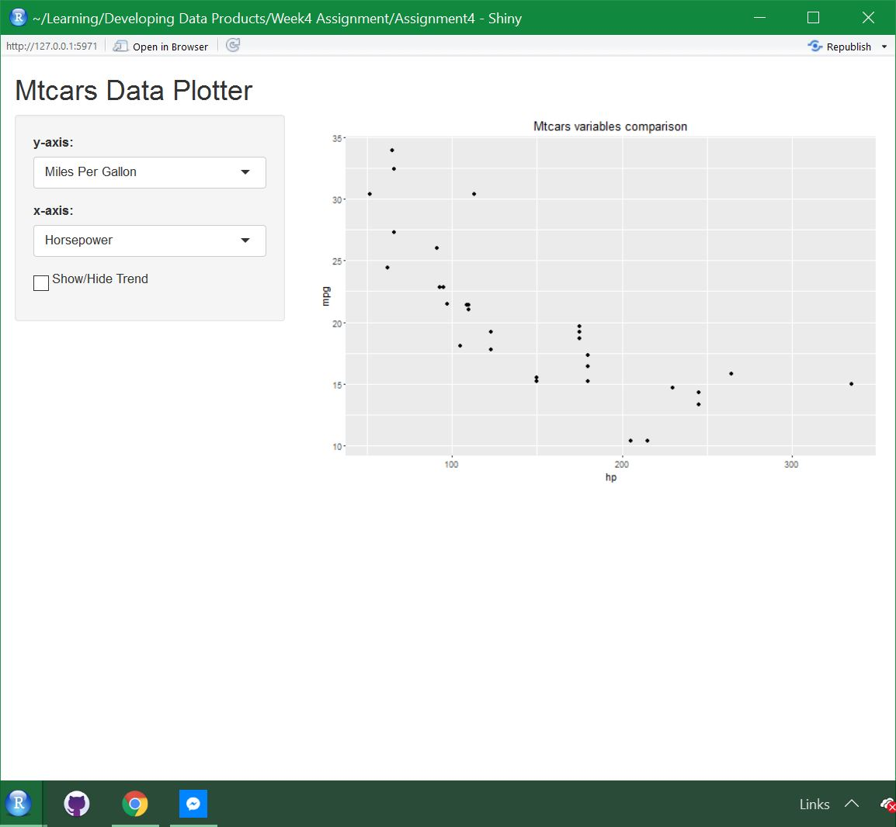

```{r setup, include=FALSE}
knitr::opts_chunk$set(echo = FALSE)
```

## Introduction

Examining data can be daunting for a the general public. Most do not know how to put graphs together using the many tools out there. 

This application attemps to solve that problem.

## Features
The mtcars data graphing application allows users to select what data enters into the X and y axis. The application then automatically plots the data

```{r, out.width = "400px", fig.align='center'}

```

## Features (cont.)
This gives the users full simple control over what they want to see
```{r, out.width = "400px", fig.align='center'}

```

## R Version
```{r version, echo = TRUE, comment=""}
R.version[13]
```

## System Info
```{r sysinfo, echo = TRUE, comment = ""}
Sys.info()[1:3]
```
